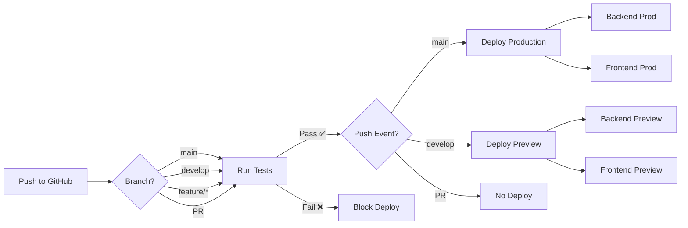

# Quick Reference: Deploy Hooks

## 🔑 Required GitHub Secrets

Add these 4 secrets to your GitHub repository:

```
Settings → Secrets and variables → Actions → New repository secret
```

| Secret Name | Get From | Used For |
|-------------|----------|----------|
| `VERCEL_BACKEND_DEPLOY_HOOK_PROD` | Vercel Backend → Settings → Deploy Hooks (main branch) | Production backend deployment |
| `VERCEL_BACKEND_DEPLOY_HOOK_DEV` | Vercel Backend → Settings → Deploy Hooks (develop branch) | Preview backend deployment |
| `VERCEL_FRONTEND_DEPLOY_HOOK_PROD` | Vercel Frontend → Settings → Deploy Hooks (main branch) | Production frontend deployment |
| `VERCEL_FRONTEND_DEPLOY_HOOK_DEV` | Vercel Frontend → Settings → Deploy Hooks (develop branch) | Preview frontend deployment |

## 🚀 Deployment Flow



## 📋 Checklist

- [ ] Create 4 deploy hooks in Vercel (2 for backend, 2 for frontend)
- [ ] Add 4 secrets to GitHub repository
- [ ] Push to `develop` branch to test
- [ ] Verify deployments in Vercel dashboard
- [ ] Check GitHub Actions logs
- [ ] Merge to `main` for production

## 🔍 Testing

```bash
# Test preview deployment
git checkout develop
git commit --allow-empty -m "test: trigger preview deployment"
git push origin develop

# Test production deployment
git checkout main
git merge develop
git push origin main
```

## 📊 What Gets Deployed

| Trigger | Tests Run | Backend Deploy | Frontend Deploy |
|---------|-----------|----------------|-----------------|
| Push to `main` | ✅ All | ✅ Production | ✅ Production |
| Push to `develop` | ✅ All | ✅ Preview | ✅ Preview |
| Pull Request | ✅ All | ❌ No | ❌ No |
| Push to `feature/*` | ✅ All | ❌ No | ❌ No |

## 🛠️ Vercel Project Settings

### Backend Project
- **Framework Preset**: Other
- **Root Directory**: `apps/backend`
- **Build Command**: `npm run build -w packages/shared && npx prisma generate --schema=apps/backend/prisma/schema.prisma && npm run build -w apps/backend`
- **Output Directory**: `apps/backend/dist`
- **Install Command**: `npm install`

### Frontend Project
- **Framework Preset**: Vite
- **Root Directory**: `apps/frontend`
- **Build Command**: `npm run build -w packages/shared && npm run build -w apps/frontend`
- **Output Directory**: `apps/frontend/dist`
- **Install Command**: `npm install`

## 🔗 Useful Links

- [Vercel Deploy Hooks Documentation](https://vercel.com/docs/deployments/deploy-hooks)
- [GitHub Actions Secrets](https://docs.github.com/en/actions/security-guides/encrypted-secrets)
- [Full Setup Guide](./DEPLOY_HOOKS_SETUP.md)
